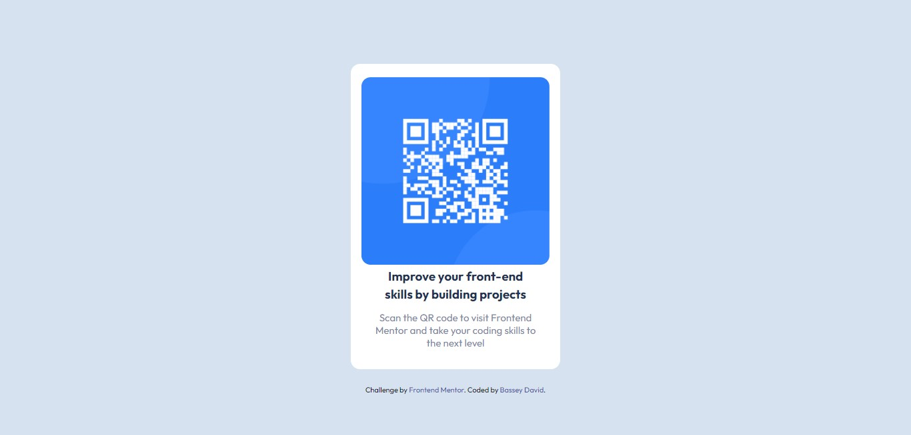

# Frontend Mentor - QR code component solution

This is a solution to the [QR code component challenge on Frontend Mentor](https://www.frontendmentor.io/challenges/qr-code-component-iux_sIO_H). Frontend Mentor challenges help you improve your coding skills by building realistic projects.

## Table of contents

- [Overview](#overview)
  - [Screenshot](#screenshot)
  - [Links](#links)
- [My process](#my-process)
  - [Built with](#built-with)
  - [What I learned](#what-i-learned)
  - [Continued development](#continued-development)
  - [Useful resources](#useful-resources)
- [Author](#author)

## Overview

### Screenshot




### Links

- Solution URL: [Add solution URL here](https://github.com/Davidbassey01/Project1.git)
- Live Site URL: [Add live site URL here](http://127.0.0.1:5500/index.html)

## My process

### Built with

- Semantic HTML5 markup
- CSS custom properties
- Mobile-first workflow

### What I learned

```css
main {
  background: var(--White);
  border-radius: 14px;
  width: 23%;
  height: 70%;
  position: absolute;
  top: 50%;
  left: 50%;
  transform: translate(-50%, -50%);
  align-items: center;
  justify-items: center;
  text-align: center;
}
```

### Continued development

i would like to focus more on responsiveness of websites including landscape...

### Useful resources

- [resource 1](https://www.w3schools.com) - This helped me for viewport height and width.

## Author

- Website - [Bassey David](https://github.com/Davidbassey01/Project1.git)
- Frontend Mentor - [@davidbassey01](https://www.frontendmentor.io/profile/davidbassey01)
